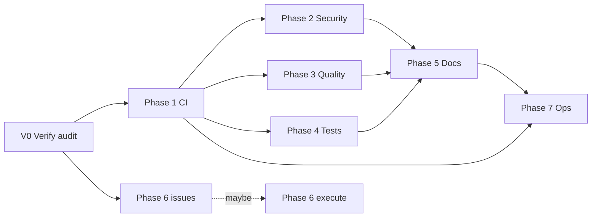

# PowerSync Remediation Plan — Constitution Compliance

**Plan date:** 2026-05-27
**Constitution:** `~/Documents/engineering-constitution.md`
**Inputs:** `docs/audits/engineering-constitution-audit.md` (v2 + corrections), `docs/audits/meta-audit.md`, `docs/audits/python-exhaustive-data.md`
**Scope:** every FAIL / PARTIAL principle in the audit's pass/fail matrix
**Related:** `PRJ-013 powersync-remediation` (BASE), Phase 1 Documentation+Privacy+CI — currently stale; this plan supersedes/extends it.

## 0. Explicit assumptions

Per constitution #8, name assumptions up-front so they can be challenged.

1. The target is **constitution compliance for daily-driver personal use**, not "convince bolagnaise to accept all of this." Ryan installs from his fork.
2. **Time budget:** 4–6 hrs/week, evenings/weekends. Civilian transition Jan 2027. Any phase >40 hrs of work = 2-month elapsed item. Plan accordingly.
3. **Upstream stays alive.** bolagnaise ships ~14 commits/day. Any fork-only patch carries merge cost forever; minimize divergence.
4. **Validation is non-negotiable.** Meta-audit lesson: every claim ("done", "fixed", "X count is now Y") must have a re-runnable verification command. If it isn't verifiable, it isn't done.
5. **PAUL/BASE integration.** This plan converts into PAUL phases on PRJ-013 if Ryan wants the orchestration; otherwise it stands as a plain markdown plan.

## 1. Strategy — three real options

Per constitution #6, surface tradeoffs before committing.

| Option | What it is | Pros | Cons | Best for |
|---|---|---|---|---|
| **A. Upstream-PR campaign** | Open one focused PR per finding upstream. Merge there, pull to fork. | Single source of truth. Free maintenance long-term if accepted. Helps community. | Maintainer-dependent. bolagnaise's velocity + style (29% conventional-commits, 22 fix-of-fix) suggests low ceremony bar — may accept simple PRs but resist architecture-level. PR review latency unknown. | Security fixes, CI gates, docs gaps, schema validation, missing files (CHANGELOG, SECURITY). Small wins. |
| **B. Fork divergence** | Hard-fork. Rename `power_sync` → `power_sync_disciplined`. Carry everything. | Total control. Constitution-aligned from day one. | Maintenance burden forever. Loses upstream features. User base = 1. | Not recommended unless upstream becomes hostile. |
| **C. Hybrid — discipline-as-overlay on fork** | Track upstream `main` on fork. Apply small set of fork-only patches in `.github/`, CI, CHANGELOG. Bigger fixes go upstream as PRs in parallel. Auto-rebase. | Low ongoing cost. Matches `Artic0din/dev-templates` scaffold pattern Ryan uses elsewhere. Upstream contribution is opt-in per fix. | Some patches stay fork-only forever. Drift accumulates. | **Default recommendation.** Matches Ryan's existing fork-only CI workflow (`ci.yml` already calls `dev-templates/ci-core.yml@v1`). |

**Recommendation: Option C, hybrid.** Sequenced as below. Upstream-PR what bolagnaise will accept. Fork-carry what he won't. Re-evaluate quarterly.

## 2. Pre-flight (V0) — verify the audit before acting on it

Per constitution #11 (Define Done) and the meta-audit's root cause. The audit has unverified findings; planning around them risks executing wrong work.

| V0 task | Done when |
|---|---|
| V0.1 Verify C2 dep CVEs | Output captured to `docs/audits/v0-baseline/pip-audit.txt`. Confirmed/refuted CVE list updated in main audit. |
| V0.2 Verify H14 fix-of-fix count | Count captured to `docs/audits/v0-baseline/git-history.txt`. |
| V0.3 Verify H15 conventional-commits ratio | Ratio in `docs/audits/v0-baseline/git-history.txt`. |
| V0.4 Verify M17 large-diff "Fix" commits | Top-10 list with hashes + subjects in `docs/audits/v0-baseline/git-history.txt`. |
| V0.5 Verify supplemental file claims | Spot-check 5 numeric claims; either confirm or flag in `docs/audits/v0-baseline/supplemental-spotcheck.md`. |
| V0.6 Re-verify M3 — every `asyncio.sleep` ≥ 60 seconds | Comprehensive list in `docs/audits/v0-baseline/blocking-sleeps.txt`. |
| V0.7 Verify M14 — confirm `esy_sunhome` is custom not core | PyPI + GitHub + HACS lookup; confirmed/refuted in V0 README. |

**V0 commands (run from repo root):**

```bash
# V0.1 — pip-audit (resolves the >= floors and audits resolved versions, not just direct deps)
jq -r '.requirements[]' custom_components/power_sync/manifest.json > /tmp/powersync-reqs.txt
uvx --from pip-audit pip-audit -r /tmp/powersync-reqs.txt

# V0.2 — fix-of-fix commits (subject contains 'fix' twice)
git log --format='%s' | grep -ciE 'fix.*fix'

# V0.3 — conventional-commits ratio
TOTAL=$(git log --format='%s' | wc -l)
COMPLIANT=$(git log --format='%s' | grep -cE '^(feat|fix|test|refactor|perf|docs|style|chore|ci|build|revert)(\([^)]+\))?(\!)?: ')
echo "compliant: $COMPLIANT / $TOTAL"

# V0.4 — top 10 commits by line delta (preserves hash + subject)
git log --shortstat --no-merges --format='COMMIT::%h::%s' | awk '
  /^COMMIT::/ { split($0, a, "::"); hash=a[2]; subj=a[3]; next }
  /files? changed/ {
    ins=0; del=0
    for (i=1; i<=NF; i++) {
      if ($i ~ /insertion/) ins=$(i-1)
      if ($i ~ /deletion/)  del=$(i-1)
    }
    print ins+del, hash, subj
  }' | sort -rn | head -10

# V0.6 — asyncio.sleep >= 60s (regex requires extended mode)
grep -rnE "asyncio\.sleep\(([6-9][0-9]|[1-9][0-9]{2,})\)" custom_components/power_sync/

# V0.7 — esy_sunhome on PyPI (404 if not published)
curl -sIL https://pypi.org/pypi/esy_sunhome/json | head -1
```

**Effort:** ~2 hours.
**Gate:** No phase below executes until V0 is committed.
**Principles:** #1, #8, #11, #15, #17.

## 3. Phase plan

Each phase has: **goal**, **principles closed**, **tasks with done-criteria + verification commands**, **PR strategy (upstream/fork/both)**, **effort estimate**, **rollback plan**.

---

### Phase 1 — Foundation discipline (fork only)

**Goal:** make the fork's CI catch what the audit caught, so the next regression is caught automatically.

**Principles closed:** #5, #11, #17 (CI/test discipline).

**Why first:** every later phase needs a verification gate. Without CI, fixes can regress silently.

| Task | Done when | Verification |
|---|---|---|
| 1.1 Run `scaffold-discipline python` from `Artic0din/dev-templates` | `.github/instructions/*` populated; `.github/workflows/ci.yml` calls `ci-core-python.yml@v1`; codecov.yml present | `git status` shows scaffold files |
| 1.2 Add `pyproject.toml` if absent; add `uv.lock` | uv resolves deps deterministically | `uv lock --check` passes |
| 1.3 Wire `pytest` to CI via the reusable workflow | `pytest` runs on every PR | CI green on dummy PR |
| 1.4 Wire `ruff check` + `ruff format --check` | Lint runs and reports | CI green |
| 1.5 Wire `pyright` (strict for new code, lenient for legacy) | Type check runs | CI green |
| 1.6 Wire `pip-audit` step | CVE scan runs; CI red on any vulnerability (`pip-audit` exits non-zero on any finding — has no built-in severity gate, so introduce gating via `--format=json` + `jq` parse if HIGH-only is desired) | CI red if vuln introduced |
| 1.7 Pin `pytest.ini` with `addopts = --strict-markers --cov=custom_components/power_sync --cov-report=xml`, `asyncio_mode = auto` | pytest config explicit | `pytest --collect-only` exits 0 |
| 1.8 SHA-pin `hacs/action`, `home-assistant/actions/hassfest`, `JamesIves/github-sponsors-readme-action`, `stefanzweifel/git-auto-commit-action` in fork's workflows | All non-allowlist actions are SHA refs | `grep -rE 'uses:.*@(main&#124;master&#124;v[0-9]+)$' .github/workflows/` returns 0 lines for non-allowlist (note: `&#124;` rendered `\|` for table-safe display; actual shell uses raw `\|`) |
| 1.9 Add `.github/dependabot.yml` for `pip` + `github-actions` | Bot opens PRs weekly | First Dependabot PR exists |
| 1.10 Add `SECURITY.md` — disclosure path + supported versions | File exists, linked from README | `gh repo view` shows security policy detected |
| 1.11 Add `CHANGELOG.md` with `[Unreleased]` section | File exists | Linked from README |
| 1.12 Add `.github/ISSUE_TEMPLATE/{bug,feature,question}.yml` + `PULL_REQUEST_TEMPLATE.md` + `CONTRIBUTING.md` + `CODEOWNERS` | Templates render on new-issue/PR pages | Manual check on `gh issue create` form |
| 1.13 Add `.gitignore` HA-specific patterns: `.HA_VERSION`, `.storage/`, `secrets.yaml` | Patterns present | `git check-ignore .HA_VERSION` returns 0 |

**PR strategy:** fork-only. `Artic0din/PowerSync` only. Already in `chore/scaffold-discipline-stack` direction.
**Effort:** ~8 hours.
**Rollback:** all changes in one feature branch; revert merge if catastrophic.
**Done when:** CI green on a no-op PR; `pip-audit` exits zero (or jq-parsed result confirms zero HIGH-severity findings if severity gating is configured); Dependabot has opened its first PR.

---

### Phase 2 — Security hardening (upstream + fork)

**Goal:** close every verified #15 finding.

**Principles closed:** #15, #5 (production-grade secrets/auth/validation).

**Prerequisite:** Phase 1 complete (CI must catch regressions in security fixes).

| Task | Approach | Done when | Verification |
|---|---|---|---|
| 2.1 Strip `token[:N]` partial logging — `inverters/enphase.py:405`, `automations/actions.py:1861,1875`, `automations/__init__.py:885` | Replace with `"[redacted]"` or token-length-only. Add unit test asserting no token chars in log. | `grep -rn 'token\[:' custom_components/` returns 0 | Upstream PR (single focused, ~30 lines); fork-merge regardless |
| 2.2 Add `vol.Schema` to all 30 services in `__init__.py` | Define schemas in a `_SCHEMAS = {...}` dict; pass `schema=` on `async_register`. Reject malformed inputs at boundary, not in handlers. | All 30 `async_register` calls have `schema=`. Verify: `grep -c 'async_register(' __init__.py` returns 30; `grep -A8 'async_register(' __init__.py &#124; grep -c 'schema='` returns 30 | Upstream PR (may need to split — high-impact services first: `force_discharge`, `force_charge`, `set_backup_reserve`, `set_operation_mode`, `set_grid_charging`) |
| 2.3 Tighten loose `>=` dep pins to enforce upgrade floor | V0.1 confirmed no current CVEs, but `>=X.Y.Z` pins admit drift. Set conservative `>=` floors at latest patched + `<MAJOR+1` ceilings to enforce upgrade discipline without major-break risk. | `pip-audit -r manifest.json` clean (per V0.1 baseline) AND minimum bounds reflect latest patched releases | Upstream PR (single line per dep) |
| 2.4 Document TLS-bypass risk | `powerwall_local/transport.py:59-60`, `inverters/enphase.py:491-492`: add explicit block comment: rationale, scope (LAN only), risk (MITM in adversarial LAN), why no alternative (no Tesla/Enphase CA). | Comment block present + scope assertion that target is RFC1918 | Upstream PR |
| 2.5 Scope `_SSL_CONTEXT` singleton | `__init__.py:4836` — refactor `get_insecure_ssl_context` to require explicit per-host opt-in. | Function signature requires `host` param + asserts it's RFC1918 | Upstream PR or fork-only if upstream pushes back |
| 2.6 Replace `ast.literal_eval` fallback at `__init__.py:650` with `json.loads` + plain coercion | Lower attack surface | `grep -n ast.literal_eval __init__.py` returns 0 in that path | Upstream PR (small) |
| 2.7 FoxESS MD5 + raw api_key | Upstream protocol limitation. Open upstream issue documenting risk; no code change. | Issue filed; comment block in `foxess_api.py` referencing upstream limitation | Fork-only doc + upstream issue |

**PR strategy per task above.**
**Effort:** ~12 hours.
**Rollback per task:** each task = one commit / one PR. Revert single commit if regression.
**Done when:** all 7 tasks closed; `pip-audit -r manifest.json` exits 0; `grep -rn 'token\[:' custom_components/` returns 0; all 30 `async_register` calls have `schema=`.

---

### Phase 3 — Code quality bones (fork-led)

**Goal:** close #1, #4, #14 findings that are mechanical and don't require architectural buy-in.

**Principles closed:** #1, #4, #5 (logging), #14.

| Task | Approach | Done when | PR strategy |
|---|---|---|---|
| 3.1 Add `diagnostics.py` per HA convention | Implement `async_get_config_entry_diagnostics` + `async_get_device_diagnostics`. Redact tokens. | File exists; HACS Hassfest passes; "Download diagnostics" UI button works on a real install | Upstream PR (uncontroversial — HA quality scale requirement) |
| 3.2 Centralize magic timeouts: 122× `ClientTimeout(total=30)` → `_DEFAULT_HTTP_TIMEOUT = ClientTimeout(total=30)` in `const.py` | One constant, all sites reference it. | `grep -rn 'ClientTimeout(total=30)' custom_components/` returns 1 (the definition) | Upstream PR (single-file refactor) |
| 3.3 Centralize `asyncio.sleep(1)` cluster (28 sites) → `_POST_WRITE_SETTLE_SEC = 1.0` constant in `const.py` | Named semantic constant | `grep -rn 'asyncio.sleep(1)' custom_components/inverters/` returns 0; replaced with constant | Upstream PR |
| 3.4 Centralize `max_retries` (4 redefinitions) → `_DEFAULT_MAX_RETRIES = 3` | Single definition | All 4 sites import constant | Upstream PR |
| 3.5 Centralize the 100 hardcoded `sensor.*` entity-ID strings | Group by domain: `_SOLCAST_ENTITY_IDS = (...)` in `const.py`; cluster at `coordinator.py:6601-6698` is the priority | Cluster reduced; constants pulled out | Upstream PR (medium — large diff but mechanical) |
| 3.6 Convert hot-path `_LOGGER.info` → `_LOGGER.debug` in `coordinator.py` (82 of 88 calls) | Manual audit per call: one-shot setup keeps info; per-cycle moves to debug | `python` script counts info-calls in update methods → 0; setup-paths preserved | Upstream PR |
| 3.7 Same for `sensor.py` (37 info-level) | Same rule | Hot-path info → debug | Upstream PR |
| 3.8 Reduce broad `except Exception:` from 938 to <100 | Targeted refactor: replace with specific types where the actual exception is knowable; document the swallow with `# noqa: BLE001 — reason` per remaining case | Count <100; remaining cases have rationale comments | Fork-only refactor over multiple PRs; upstream as small per-file PRs |
| 3.9 Eliminate 74 silent `pass` swallows | Convert to `_LOGGER.debug` + structured handling; or re-raise | `python3` AST check finds 0 `except Exception: pass` patterns | Upstream PRs per file |
| 3.10 Normalize API error semantics (`localvolts_api` returns None vs `octopus_api`/`aemo_api` raise) | Pick raise-or-return-None; document the contract; refactor offenders | All `*_api.py` use same convention; documented in `*_api.py` module docstring | Upstream PR |
| 3.11 Add `_LOGGER` to 18 modules missing it (5 with business logic priority) | Standard declaration | `_LOGGER = logging.getLogger(__name__)` in every business-logic module | Upstream PR |
| 3.12 Move 5-min blocking sleep at `optimization/ev_coordinator.py:218` | Convert to scheduled callback via `async_call_later` or coordinator update-interval | `grep -n 'asyncio.sleep(300)' custom_components/` returns 0 | Upstream PR |
| 3.13 1 Hz AEMO polling at `coordinator.py:3055` | Bump to ≥5 s (or align to 5-min publication cadence with deterministic offset) | `_ACTIVE_INTERVAL ≥ 5`; comment justifies | Upstream PR |

**Effort:** ~30 hours.
**Rollback:** per-PR.
**Done when:** all 13 tasks closed; `grep`-based verification commands pass.

---

### Phase 4 — Test rigor (fork-led, upstream-friendly)

**Goal:** close #17. The audit's strongest claim is "core modules untested" — fixing this is the highest leverage.

**Principles closed:** #11, #13, #17.

| Task | Approach | Done when | PR strategy |
|---|---|---|---|
| 4.1 Replace 10 worst AST source-text "regression" tests | Identify via `grep -rln 'ast.get_source_segment\|ast.unparse' tests/`; rewrite each to execute the code path being claimed. | All 10 listed tests use call+assert, not source-text introspection | Upstream PR |
| 4.2 Write `test_coordinator.py` covering each coordinator subclass (20+) | Mock HTTP at boundary; assert behaviour on success, failure, retry paths | File exists; coverage of `coordinator.py` >= 60% (set baseline post-creation) | Upstream PR |
| 4.3 Write `test_sensor.py` | Per-entity-type behaviour tests | File exists; `sensor.py` coverage >= 60% | Upstream PR |
| 4.4 Write `test_*_api.py` for each missing API client: `aemo`, `alphaess`, `epex`, `foxess`, `localvolts`, `octopus`, `sigenergy` | Each gets a behaviour test file (some exist e.g. `test_zaptec_api.py`) | All 7 missing test files exist; each module ≥40% line coverage | Upstream PR per file |
| 4.5 Add diagnostics tests after Phase 3.1 lands | Test the redaction + structure | `test_diagnostics.py` exists | Upstream PR |
| 4.6 Set codecov baseline at current measured % | Ratchet-only in `codecov.yml` | Coverage gate active | Fork-only (codecov.yml is fork-managed) |

**Effort:** ~40 hours (the heaviest phase).
**Rollback:** per-PR.
**Done when:** every module in custom_components/power_sync/ either has a direct test file or has an explicit rationale comment in `tests/COVERAGE-RATIONALE.md` for why not.

---

### Phase 5 — Documentation + governance (fork-friendly)

**Goal:** close documentation gaps. Mechanical, low controversy.

**Principles closed:** repo defaults (hard rule #2), #19.

| Task | Done when | PR strategy |
|---|---|---|
| 5.1 Document 13 missing services in `services.yaml` (`hold_battery_soc`, `set_autonomous`, `set_grid_export_auto`, `curtail_inverter`, `restore_inverter`, 8 automation services) | All 27 services registered in `__init__.py` have an entry in `services.yaml` with `description` + `fields` + `selector` | Upstream PR |
| 5.2 Reconcile `strings.json` vs `translations/en.json` `flow_power_setup`/`flow_power_tariff` divergence | Schema diff = 0; both files load without HA UI errors | Upstream PR |
| 5.3 Reword `manifest.json` `after_dependencies` to runtime-gated check | `esy_sunhome` removed from `after_dependencies`; code-level `try: import esy_sunhome` guard | Upstream PR |
| 5.4 Fix `aemo-to-tariff >= 0.7.15` spec (or document the private build) | Confirmed resolvable on clean install | Upstream issue + PR |
| 5.5 README enhancements — CONTRIBUTING link, CI badge, screenshot section, SemBr in prose | README scores ≥80% on `markdownlint` + SemBr-check | Upstream PR |
| 5.6 SemBr-normalize `docs/wiki/*.md` (4 files) | One sentence per line throughout | Upstream PR |
| 5.7 Mark or remove `docs/wiki/EV-Charging-Refactor.md` | Status header: draft/implemented/superseded | Upstream PR or removal |
| 5.8 Add `category: integration` to `hacs.json` | Explicit | Upstream PR (one line) |
| 5.9 Deduplicate asset files: `icon@2x.png` vs `icon-512.png`; fix `logo@2x.png` to 1024×1024 | Asset audit clean | Upstream PR |
| 5.10 Bump HA minimum floor in `hacs.json` from `2024.8.0` to `2025.1.0` | After confirming integration still works against `2025.1.0` | Upstream PR |
| 5.11 Tag scheme decision — keep `v2.12.xxx` build counter OR migrate to true semver | Document the decision either way | Upstream issue (high-touch — discuss before changing) |

**Effort:** ~10 hours.
**Done when:** every task ticked; HACS+Hassfest pass on fresh install.

---

### Phase 6 — Architecture (upstream-coordination required)

**Goal:** close #4, #8, #14 god-file findings. Cannot be done unilaterally on fork without permanent divergence.

**Principles closed:** #4, #8, #14, #20.

**Pre-step:** open upstream issues *first*, before any code work. bolagnaise must agree to a split plan before 28k LOC moves around. If he doesn't, this phase becomes a fork-divergence decision (Option B).

| Task | Approach | Done when |
|---|---|---|
| 6.1 Open upstream issue: "Proposal: split `__init__.py` (28,864 LOC) into per-concern modules" | Plan: extract `services.py`, `tesla/`, `websocket/`, leave `__init__.py` as setup-only (<500 LOC). | Issue acknowledged by bolagnaise with thumbs-up or counter-proposal |
| 6.2 Open upstream issue: "Proposal: split `coordinator.py` per-provider" | Mirror existing `inverters/`, `optimization/`, `powerwall_local/` subpackage pattern. Each coordinator subclass → `coordinators/<provider>.py`. | Acknowledged |
| 6.3 Open upstream issue: "Proposal: extract `inverters/base.py` abstract methods" | `connect`, `disconnect`, `get_status`, `curtail`, `restore`. Make them `@abstractmethod`. Refactor all 19 inverter implementations to inherit. | Acknowledged |
| 6.4 Open upstream issue: "Proposal: split `config_flow.py` (10,479 LOC)" | Extract validation/probe logic. UI steps stay. Target <2,000 LOC. | Acknowledged |
| 6.5 If 6.1–6.4 accepted: execute each as its own PR series | Sequence: 6.3 (smallest, cleanest), 6.2, 6.1, 6.4. | Each merged. |
| 6.6 If 6.1–6.4 rejected: decision point — fork-divergence vs accept-debt | Document the decision in a CARL `pr-workflow` domain entry. | Decision logged. |

**Effort:** issues = 4 hours; if accepted, execution = 80+ hours over months.
**Rollback:** per-PR. Splits are mechanical but high-volume; revert single PR if regression.
**Done when:** either splits merged or decision documented to defer indefinitely.

---

### Phase 7 — Operational discipline (ongoing)

**Goal:** make the audit re-runnable + the fork sustainable. Per #14 systemic-over-local.

| Task | Done when |
|---|---|
| 7.1 Commit `scripts/verify-audit.sh` that re-runs every verification command in the audit's "How to regenerate" section | Script exists; CI runs it on PRs touching `custom_components/power_sync/` |
| 7.2 Add `python-exhaustive-data.md` regeneration to `verify-audit.sh` | Script regenerates the file from source; CI fails if drift |
| 7.3 Extract `~/.claude/templates/engineering-constitution-audit-template.md` from this audit | Template exists; PriceHawk + GridWise + PLNR can be audited with same framework |
| 7.4 Quarterly re-audit cadence on a `/schedule`'d agent | Routine fires Q1/Q2/Q3/Q4; output saved to `docs/audits/audit-YYYY-Qn.md` |
| 7.5 Fork-upstream sync cadence: weekly `git fetch upstream && git rebase upstream/main` on `Artic0din/main`; resolve conflicts on a tracking branch | Weekly cron; conflicts surfaced as GitHub issues |
| 7.6 CARL domain entry — `decisions/powersync.md`: log the upstream-PR-vs-fork choices made in Phases 2–6 | All non-trivial decisions logged via `carl_log_decision` |
| 7.7 PRJ-013 update in BASE — supersede stale Phase 1 with this plan as Phase 1–7 sequence | BASE updated; staleness clears |

**Effort:** ~6 hours setup; ongoing ~1 hr/week.

---

## 4. Sequencing & dependencies



**Critical path:** V0 → P1 → P2 → P5 → P7. ~38 hours = ~8 weeks at 5 hrs/week to a "constitution-compliant fork" milestone.
**Parallelizable:** P3 + P4 + P6-issues can run alongside P2.

## 5. Definition of "done" — campaign-level

Per constitution #11.

The campaign is done when **all** of these hold simultaneously:

1. **Verify pass:** `scripts/verify-audit.sh` exits 0 against the fork's `main`.
2. **CI pass:** every check in `.github/workflows/ci.yml` is green.
3. **Coverage:** custom_components/power_sync overall coverage ≥ baseline + 20 percentage points; no module below 40%.
4. **Security:** `pip-audit` HIGH+ count = 0; `grep -rn 'token\[:' custom_components/` = 0; all 30 services in `__init__.py` have `schema=`.
5. **Docs:** `services.yaml` documents all 27 services; CHANGELOG.md has entries; SECURITY.md present; ISSUE_TEMPLATE/ present.
6. **Type discipline:** new code requires return-type annotations (ruff rule + pyright strict for new files).
7. **Logging:** `coordinator.py` and `sensor.py` info-call counts in hot paths = 0 (per-file grep with line-context check).
8. **Magic constants:** `ClientTimeout(total=30)` count = 1; `asyncio.sleep(1)` outside `const.py` reference = 0.
9. **God files:** either split (Phase 6 done) OR decision logged to defer (Phase 6.6).
10. **Pass/fail matrix re-graded:** ≥ 12 PASS + ≤ 2 FAIL on the 18 in-scope principles.

## 6. Risks & mitigations

| Risk | Likelihood | Impact | Mitigation |
|---|---|---|---|
| bolagnaise rejects security PRs as too pedantic | Medium | High — every fix becomes fork-carry | Phase 2 PRs are small, focused, security-framed. Open with rationale. If rejected, fork-only with rebase discipline. |
| Upstream architecture proposals (Phase 6) ignored | High | Medium — falls back to fork-divergence decision | Phase 6 starts with issues, not PRs. Decision documented either way. |
| Coverage gate too aggressive — blocks normal work | Medium | Medium | Set baseline at current measured number, ratchet 1pp at a time. |
| Time slippage: 8-week critical path → 16+ weeks | High | Low — plan is sequenced for incremental wins | Each phase produces independently shippable value. Stop at any phase boundary and have a better fork. |
| Force-rebase / upstream squash breaks fork patches | Medium | Medium | Track upstream via `git fetch && rebase` weekly (Phase 7.5). Catch drift early. |
| Audit finds new issues not in this plan during execution | High | Low | Add to backlog; address in next quarterly audit (Phase 7.4). Don't scope-creep this plan. |

## 7. What this plan does NOT do

Per constitution #3 (No Silent Scope Reduction), name what's deliberately out:

- **Does not refactor the frontend JS** (`*.js` under `custom_components/power_sync/frontend/`). Out of constitution scope; flagged as gap.
- **Does not address tag scheme** (`v2.12.xxx` build counter vs semver) beyond filing an issue (5.11). Real change requires upstream agreement.
- **Does not migrate license** away from PolyForm Noncommercial.
- **Does not fix bolagnaise's commit-message style** (29% conventional-commits). Fork enforces conventional-commits on its own commits via post-commit hook (already in place).
- **Does not handle Tesla Fleet API rotation, OAuth refresh hardening, or Powerwall local cert pinning** — labelled as future work in Phase 7 backlog.
- **Does not write a full new test suite from scratch** — only fills the worst gaps (Phase 4.2–4.4 target 60% coverage on the 3 biggest modules; full coverage is out).

## 8. Recommended first action

1. **Run V0 (~2 hours).** Verify the unverified findings. Commit `docs/audits/pip-audit-baseline.txt` and any corrections back into the main audit.
2. **Open Phase 1 PR on fork.** Apply scaffold. Land CI. This gives a verification gate for every subsequent fix.
3. **Reassess.** With CI green + V0 results, re-grade the pass/fail matrix. The plan may shrink (some findings retract); it may grow (V0 surfaces new ones).

Do not start Phase 2+ before Phase 1 ships. CI catches the next mistake.
